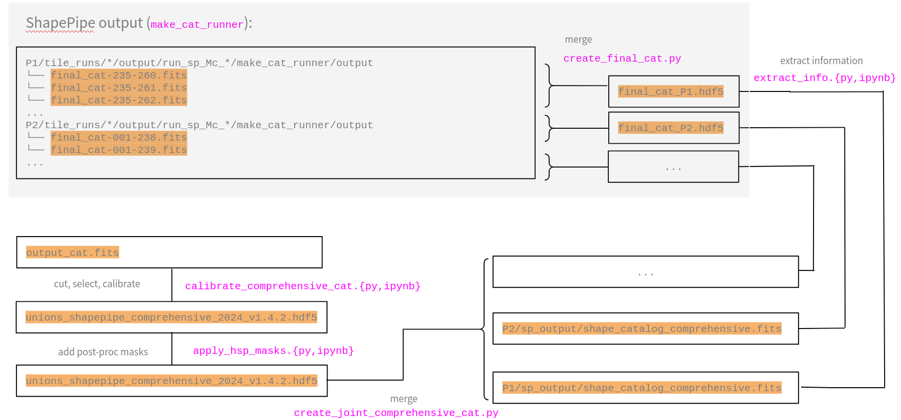

# sp_validation

Validation of weak-lensing catalogues (galaxy and star shapes and other parameters) produced by [ShapePipe](https://github.com/CosmoStat/shapepipe).

| Usage | Development | Release |
| ----- | ----------- | ------- |
| [](https://martin.kilbinger.github.io/sp_validation/) | [](https://github.com/martin.kilbinger/sp_validation/actions?query=workflow%3ACI) | [](https://github.com/martin.kilbinger/sp_validation/releases/latest) |
| [](https://github.com/martin.kilbinger/sp_validation/blob/master/LICENCE.txt) | [](https://github.com/martin.kilbinger/sp_validation/actions?query=workflow%3ACD) | [](https://pypi.org/project/sp_validation/) |
| [](https://github.com/wemake-services/wemake-python-styleguide) | [](https://codecov.io/gh/martin.kilbinger/sp_validation) | [](https://www.python.org/downloads/source/) |
| [](https://github.com/martin.kilbinger/sp_validation/blob/master/CONTRIBUTING.md) | [](https://www.codefactor.io/repository/github/martin.kilbinger/sp_validation) | |
| [](https://github.com/martin.kilbinger/sp_validation/blob/master/CODE_OF_CONDUCT.md) | [](https://pyup.io/repos/github/martin.kilbinger/sp_validation/) | |

---
> Authors: <a href="www.cosmostat.org" target="_blank" style="text-decoration:none; color: #F08080">CosmoStat</a> lab at CEA Paris-Saclay;
  Martin Kilbinger, Axel Guinot.  
> Contributors: Emma Ayçoberry, Lucie Baumont, Clara Bonini, Cail Daley, Samuel Farrens, Sacha Guerrini, Fabian Hervas Peters.</a>  
> Email: <a href="mailto:martin.kilbinger@cea.fr" style="text-decoration:none; color: #F08080">martin.kilbinger@cea.fr</a>  
---

This package contains a library and several scripts and notebooks. The main
tasks that can be performed by `sp_validation` are:
- Shear validation, in particular for the output of the `shapepipe`
  pipeline. This task takes on input a shear catalogue with metacal information,
  performs the calibration and carries out various tests, e.g. PSF leakage.
  A calibrated shear catalogue is then created on output.  
- Post processing. A number of scripts allow further processing of the above
  output calibrated shear catalogue.  
- Cosmology validation. This task uses the calibrated shear catalogue from
  above to run detailed diagnostics useful for further cosmology analysis,
  e.g. rho- and tau-statistics, E-/B-mode decomposition. Several catalogues
  can be compared and useful plots are created.
- Cosmology inference. This task uses the calibrated shear catalogue from
  a shear validation run and performes cosmology inference using the two-point
  correlation function.

## Container Installation (Recommended)

The easiest way to install sp_validation is via a container. Docker images are automatically built and pushed to the [Github Container Registry (GHCR)](ghcr.io/cosmostat/sp_validation) for each release. This image can be installed and run on most systems (including clusters) with just a few lines of code.

We recommend running the image with **Apptainer** (formerly Singularity) which is installed on most HPC clusters. To simply run the image, use the following command:

```bash
# build writeable "sandbox" container in the current directory
# ./sp_validation will be a directory that functions like a vm
apptainer build --sandbox sp_validation docker://ghcr.io/cosmostat/sp_validation:develop

# open a shell in the container
apptainer shell --writable sp_validation 
# and confirm that the installation was successful
python -c "import sp_validation"
```

You can also run the image with **Docker**:

```bash
docker run --rm -it ghcr.io/cosmostat/sp_validation:pyproject_docker python -c "import sp_validation"  
```

We do not currently build images for Apple Silicon/amr64; however the amd64 images should work on these systems, albeit with reduced performance.


## Flow chart

The following flow chart illustrates the steps required to go from ShapePipe output products
to calibrated and well-selected galaxy catalogues.




## Run shear validation

See the [documentation](docs/source/run_validation.md) for instructions on how to set up and run `sp_validation`.


## Post processing

The output(s) of one or more [shear validation runs](#run-shear-validation) can
be processed further with post-processing scripts. See
[here](docs/source/post_processing.md) for details.

## Cosmology validation

TBD.

## Cosmology inference

See the corresponding [documentation](cosmo_inference/README.md).
