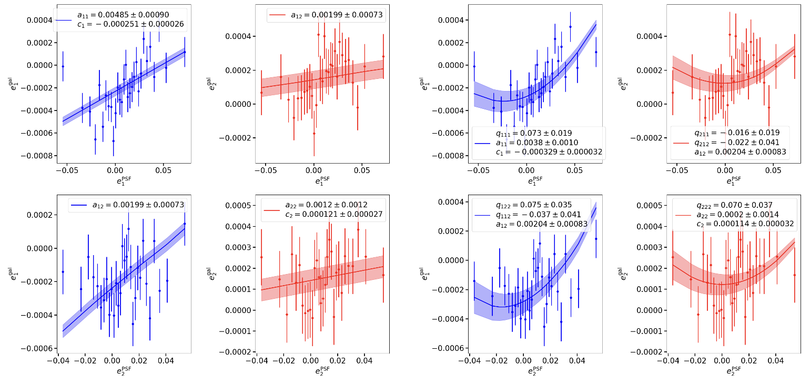
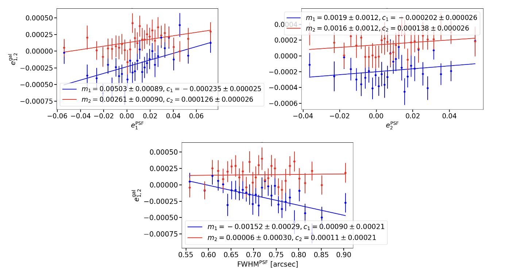
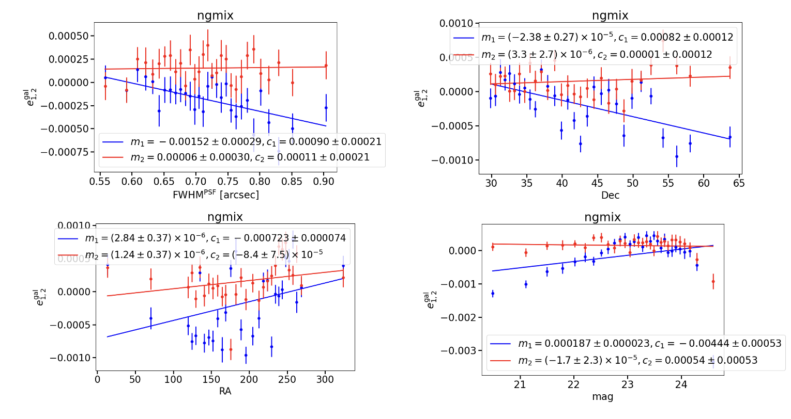
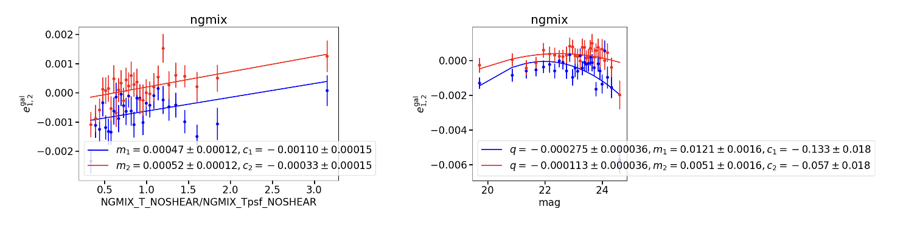
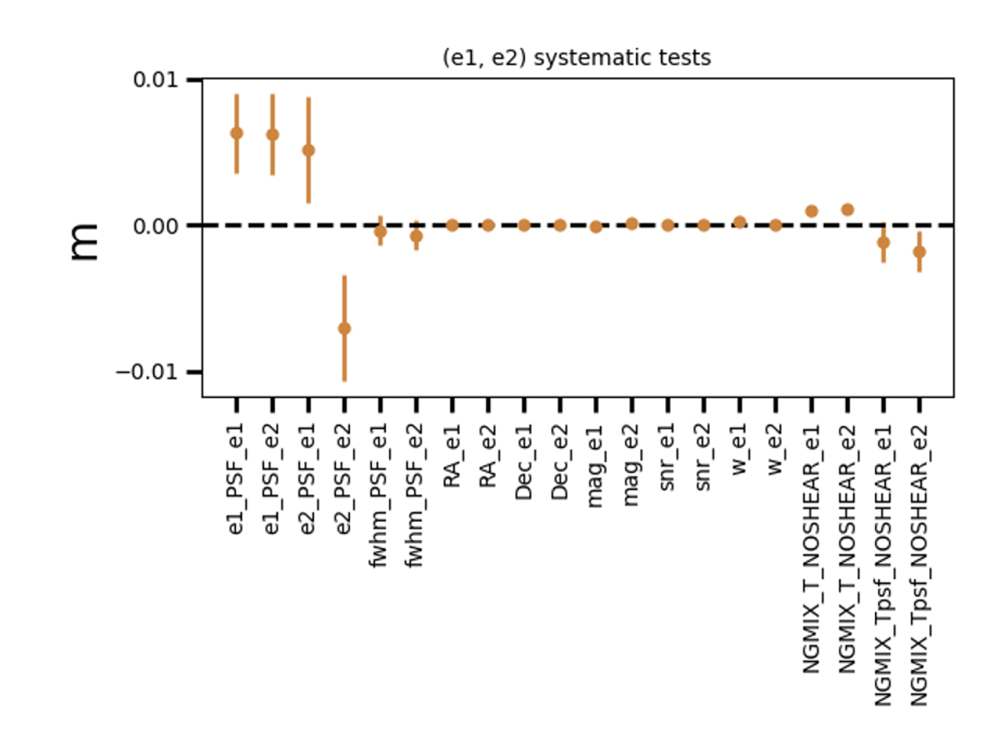

# Leakage_object Tutorial
Python Script from `sp_validation` package (path :`sp_validation/scripts/leakage_object.py`)  
_Compute the Leakage from PSF ellipticity or any quantity,  to galaxy ellipticity_
- - - -
> **Authors :**   
> Martin Kilbinger   
> Axel Guinot   
> Clara Bonini   
- - - -
## Input/Output
* **Input** : Extended shear catalogue (with at least e1_gal, e2_gal and the quantities for the Leakage (e1_PSF and e2_PSF or Observational variables)   
(for example :`unions_shapepipe_extended_2022_v1.0.fits`)  
* **Output** :  
* For `--PSF_Leakage` :  
	* Plots of the 2d Linear and quadratic Fits e_gal vs e_PSF  
	* Plots 1d Linear fits of e_gal vs e_PSF and e_gal vs FWHM_PSF  
	* Statistic file with the slopes  

-> _Example_:  
_PSF Leakage_ Plots for `unions_shapepipe_extended_2022_v1.0.fits`. Command line: 
```bash
leakage_object.py -i /path/unions_shapepipe_extended_2022.fits -o PSF_Leakage --PSF_Leakage -v
```




				     
* For `--Obs_Leakage` :  
	* Plots 1d Linear or quadratic fits of e_gal vs quantities  
	* Plots a recap with all the slopes  
	* Statistic file with the slopes  
	
-> _Examples_:  
* Leakage linear plots for `unions_shapepipe_extended_2022_v1.0.fits` catalogue of FWHM_PSF, Dec, RA, mag quantities: (with `--linear` option). Command line:  
```bash
leakage_object.py -i /path/unions_shapepipe_extended_2022.fits -o Obs_Leakage --Obs_Leakage --header --linear -v
```



* _Leakage linear and quadratic_ Plots for P3 (SP) of T_gal/T_psf and mag. Command line for left plot:  
```bash
leakage_object.py -i /path/unions_shapepipe_extended_2022.fits -o Obs_Leakage --Obs_Leakage --header --linear --ratio -v
```
Right plot:  
```bash 
leakage_object.py -i /path/unions_shapepipe_extended_2022.fits -o Obs_Leakage --Obs_Leakage --header --quadratic -v
```



* Example of a recap plot with all the slopes for various quantity of P3 (SP). Command line :  
```bash
leakage_object.py -i /path/unions_shapepipe_extended_2022.fits -o Obs_Leakage --Obs_Leakage --header --linear -v
```


- - - -
## Options
_* : mandatory options in command line

### Path Options
`--input_path_shear`* (_string_): Give the extended shear catalogue (as the unions or the Lensfit catalogue)  
`--output_dir` (_string_) : Output directory label  

### Options for changing the label of the usual default columns of the catalogue  
`--e1_col`  (_string_)  
`--e2_col`  (_string_)  
`--e1_PSF_col`  (_string_)  
`--e2_PSF_col`  (_string_)  
`--size_PSF_col`  (_string_)  
`--RA`  (_string_)  
`--Dec`  (_string_)  
`--mag`  (_string_)  

### Leakage Options* (choose at least one or both)
`--PSF_Leakage` (_store_true_): will run the PSF Leakage  
`--Obs_Leakage` (_store_true_): will run the Leakage of various quantities  

### Fits Options for `--Obs_Leakage` (linear fit by default if no options)   
`--linear` (_store_true_) : for a linear fit  
`--quadratic` (_store_true_) : for a quadratic fit  

### Ratio Options  
`--ratio` (_store_true_): will compute the Leakage of a ratio between two columns (with Leakage of other quantities)  
`--ratio_alone` (_store_true_): will compute the Leakage of a ratio between two columns and end the program (no Leakage of other quantities)  
`--ratio_label` (_string_): change the label of the ratio for the plot ticks (can be long in the plot compared with the other names)  

### Other Options
`--shapes` (-s) (_string_) : change the measurement method  
`--verbose` (-v)  (_store_true_) : verbose output  
`--test` (-t) (_store_true_) : test of 2D fit (only for PSF Leakage)  
`--header` (_store_true_): Run interactive session : print the header of the catalogue and allow to choose the variables for the Leakage by typing them in the terminal (useful when you don’t know the precise label of the variables or don’t want to change the labels one by one with other options), without it will run the leakage for default variables put in an array (`label_quant`) (can manually change this array in the main function to not passing by this option)  


### Examples of basic command lines : 
```bash

#PSF Leakage :
leakage_object.py -i /path/unions_shapepipe_extended_2022.fits -o PSF_Leakage --PSF_Leakage -v

#Observatinnal quantities Leakage :
leakage_object.py -i /path/unions_shapepipe_extended_2022.fits -o Obs_Leakage --Obs_Leakage --header --linear -v

#For both : 
leakage_object.py -i /path/unions_shapepipe_extended_2022.fits -o Leakage --PSF_Leakage --Obs_Leakage --header --linear -v

```

- - - -

## Main Function :
* Set default parameters  
* Command line options checks and updates  
* Saving log file with the command line and create the output directory  
* Configuration of the shape measurement   
* Open the input shear fits file and extract the data  
* if `--PSF_Leakage` -> create a statistic file and run the `PSF_leakage(...)` function  
* if `--Obs_Leakage` -> create a statistic file and run the `Obs_Leakage(...)` function  

- - - -
## Functions :
*  `PSF_leakage(dat,param,stats_file)` : Computes and plots object-by-object PSF Leakage relations 
-> Plots 2d correlation with the function  `corr_2d()` of the `leakage.py` module
-> Plots 1d affine correlation for the e_gal vs e_PSF and the e_gal vs PSF_size with the `affine_corr_n()` function of the `leakage.py` module

*  `Obs_Leakage(dat_shear,param,stats_file2)` : Computes and plots object-by-object any quantities Leakage relations 
-> In function of the options of the command line as — —ratio, — —header… computes the relation between the input or default quantities and the galaxy ellipticities and plot it with the function `corr_any_quant()` of the `leakage.py` module
	

- - - -
## Functions imported from `leakage.py` library module  
#### PSF Leakage fit functions:  
For 2d correlation :  
* `corr_2d(...)` : computes and plots 2D linear and quadratic correlations of (y1, y2) as function of (x1, x2)  
For 1d linear correlation:  
*  `affine_corr_n(...)`: computes n affine correlations of y(m) vs x_arr[n]  
* `affine_corr(...)`: computes and  plots  affine correlation of y(n) as function of x (use `func_bias_lin_1d()` and  `loss_bias_lin_1d()`  for the computation of linear model)  


#### Obs_Leakage Linear fit functions:  
*  `corr_any_quant(dat,param,stats_file,label_quant,ratio)` : In function of the options — —linear or — —quadratic in the command line, computes the linear or the quadratic best fit for the n quantities of the array label_quant and/or  the ratio, with the fits  functions `affine_corr_n_quant()` and `quad_corr_n_quant()`  
* `affine_corr_n_quant(...)`  : edited version of `affine_corr_n()` which extracts the slopes with the errors and the names associate from the function `affine_corr_quant()`and plots a recap of the slopes as a function of the quantity. (Cf Output)  
*  `affine_corr_quant(...)` :  edited version of `affine_corr()` which computes the best linear fit for each quantity for all the values and plot the binned ellipticity of galaxies as a function of the quantities and return the slope, the error and the name for each quantity (use `func_bias_lin_1d()` and  `loss_bias_lin_1d()`  for the computation of linear model)  
 	
* `affine_corr_n_quant(...)`   ;  `affine_corr_quant(...)`  ;  `loss_bias_quad_1d(...)`   ; `func_bias_quad_1d(...)` -> same but for quadratic model  
